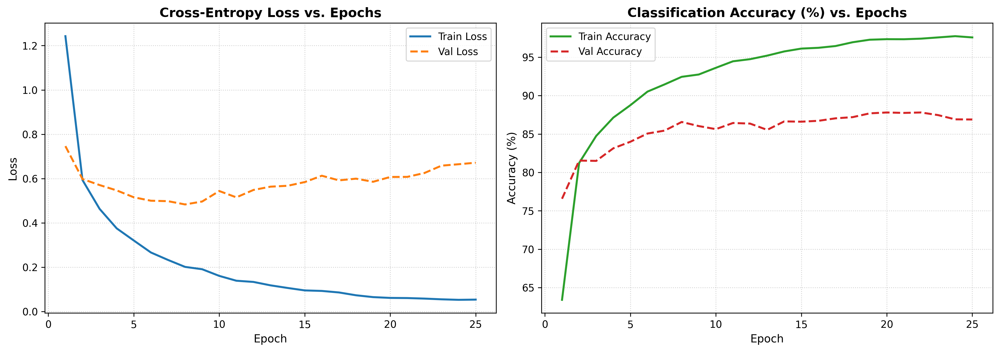
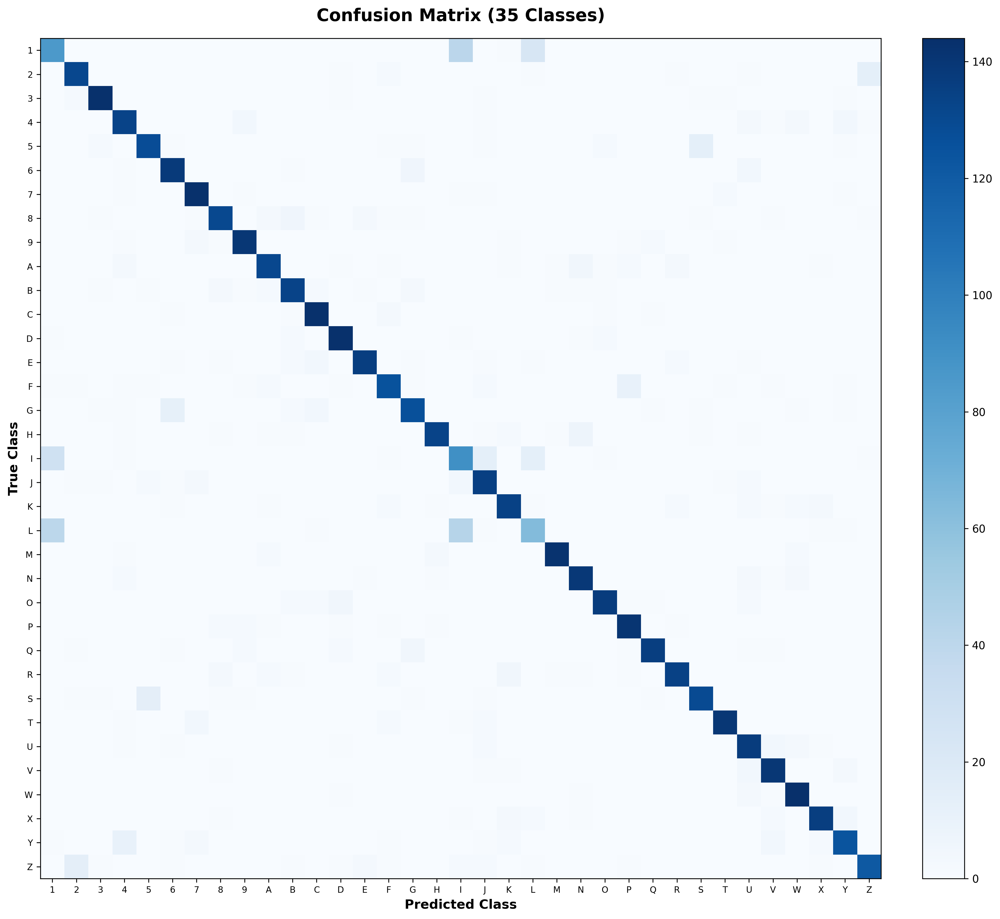
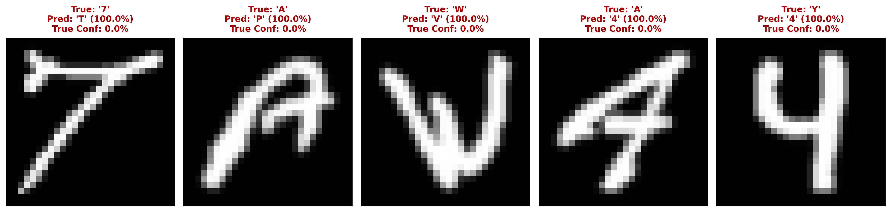

# Optic-X: Handwritten Character Recognition Neural Network from Scratch

A multilayer perceptron (MLP) built from first principles in **pure NumPy** (zero PyTorch, TensorFlow, Keras, or Scikit-Learn) to classify **35 alphanumeric character classes**:
- **Digits 1–9** (9 classes; digit `0` explicitly omitted)
- **Uppercase Letters A–Z** (26 classes)

Developed for the **ZenteiQ AI Hub - AI/ML Engineer Internship Assessment**.

---

## Performance Highlights

| Metric | Result |
| :--- | :---: |
| **Peak Validation Accuracy** | **87.81%** |
| **Test Set Accuracy (Unseen)** | **86.93%** |
| **Macro Precision** | **87.09%** |
| **Macro Recall** | **86.93%** |
| **Macro F1-Score** | **86.90%** |
| **Training Speed** | ~0.72s / epoch on standard CPU |

---

## Visualizations

### 1. Training & Validation Trajectory


### 2. 35-Class Confusion Matrix Heatmap


### 3. Top Misclassified Cases & Structural Analysis


---

## Architectural Highlights

- **Hierarchical Capacity ($784 \rightarrow 256 \rightarrow 128 \rightarrow 35$):** Two hidden layers extract low-level stroke primitives (edges, curves, slopes) and compose them into structural sub-parts (loops, crossbars), preventing underfitting on nuanced character pairs (e.g., `'1'` vs. `'I'`, `'8'` vs. `'B'`).
- **He (Kaiming) Normal Initialization:** Preserves forward activation variance $\text{Var}(A^{[l]}) = \text{Var}(A^{[l-1]})$ under ReLU activation, preventing vanishing gradients.
- **EMNIST Orientation Correction:** Corrects the column-major transposition quirk in the raw EMNIST dataset via `img.reshape(28, 28).T` before normalization to $[0.0, 1.0]$.
- **Mandated Training Sequence:**
  1. Forward propagation
  2. Backpropagation
  3. ReLU / Tanh activation derivatives
  4. Numerically stable Softmax layer ($\max(Z)$ shift)
  5. Categorical cross-entropy loss with log-epsilon clipping
  6. Mini-batch gradient descent with momentum ($\beta = 0.9$)
- **Validation Loop:** Tracks validation loss, validation accuracy, learning rate decay, and checkpoints the best weights to `.npz`.

---

## Project Structure

```
Optic-X/
├── .gitignore                         # Ignores large raw CSVs and bytecode
├── requirements.txt                   # Minimal dependencies (numpy, matplotlib, pillow, pandas)
├── README.md                          # Project overview and quickstart guide
├── REPORT.md                          # Comprehensive technical methodology report
├── train.py                           # Training pipeline with validation loop
├── evaluate.py                        # Test evaluation, confusion matrix, error analysis
├── demo.py                            # Interactive single-sample prediction script
├── src/
│   ├── __init__.py                    # Public API exports
│   ├── dataset.py                     # EMNIST loader, 35-class filter, transpose fix, stratified split
│   ├── activations.py                 # ReLU, Tanh, and Softmax with analytical derivatives
│   ├── loss.py                        # Categorical Cross-Entropy with clipping
│   ├── model.py                       # MLP network architecture with He init, forward & backprop
│   ├── optimizer.py                   # Mini-batch SGD with momentum and learning rate scheduling
│   └── metrics.py                     # Accuracy, macro metrics, and confusion matrix in pure NumPy
├── notebooks/
│   └── character_recognition.ipynb    # Interactive demonstration and visualization notebook
└── artifacts/
    ├── model_weights.npz              # Saved model parameters
    ├── test_data.npz                  # Cached test partition (5,250 samples)
    ├── loss_accuracy_curves.png       # Training vs validation curves
    ├── confusion_matrix.png           # 35x35 confusion matrix plot
    └── error_analysis_samples.png     # Side-by-side misclassified sample analysis
```

---

## Quickstart Guide

### 1. Prerequisites & Environment Setup

Clone the repository and install the minimal dependencies:

```bash
git clone https://github.com/ShivaneshV/Optic-X.git
cd Optic-X
pip install -r requirements.txt
```

*(Note: No Scikit-Learn, PyTorch, or TensorFlow are required or used.)*

### 2. Dataset Preparation
Ensure the EMNIST dataset CSV is located at `DataSets/emnist-balanced-train.csv` (or specify via `--dataset_path`).

### 3. Training the Neural Network

```bash
python train.py --epochs 25 --batch_size 128 --lr 0.08 --momentum 0.9 --samples_per_class 1000
```

This trains the model across 35,000 samples, tracks validation accuracy epoch-by-epoch, saves the best weights to `artifacts/model_weights.npz`, and outputs `artifacts/loss_accuracy_curves.png`.

### 4. Evaluating on the Test Set

```bash
python evaluate.py
```

Outputs:
- Overall Test Accuracy, Macro Precision, Recall, and F1-score.
- High-resolution $35 \times 35$ Confusion Matrix heatmap (`artifacts/confusion_matrix.png`).
- Visual grid and typographical root-cause analysis of top 5 misclassifications (`artifacts/error_analysis_samples.png`).

### 5. Interactive Character Inference Demo (CLI)

```bash
python demo.py --num_samples 5
```

Displays predictions, ground truth, and top-3 softmax confidence probabilities on random unseen test samples.

*Tip: To inspect individual canonical samples for all 35 characters, see the exported images in `sample_test_images/`.*

---

## Documentation
For complete mathematical derivations (chain rule, softmax gradient, He initialization proofs) and in-depth structural error analysis, refer to [REPORT.md](REPORT.md).